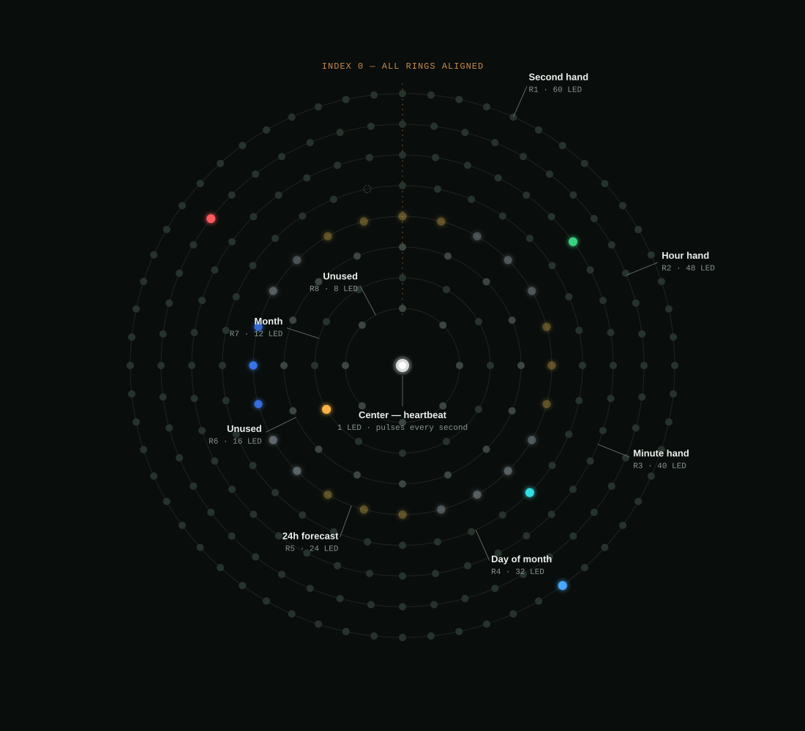

# LED Clock Display

An analog-style clock rendered on a 241-LED WS2812B concentric-ring panel,
driven by an ESP32. Hour, minute, and second "hands" sweep continuously
around dedicated rings, while month and day-of-month are fixed integer
steps on two more rings — intended to line up with printed numbers on a
3D-printed bezel. A weather forecast ring shows a fixed 24-hour-of-day dial
(also bezel-printable) with its own hour-of-day pointer, and a coarse
gradient bar-gauge shows the current temperature. WiFi and timezone are
configured from a phone via a captive portal, time is kept via NTP, weather
comes from a free API, and colors/brightness/location are adjustable live
from a web page.

See [`TRANSCRIPT.md`](TRANSCRIPT.md) for the full story of how this was
built (including the hardware detective work to figure out the panel's
wiring layout).

## Hardware



*Fig. 1 — wiring order runs outer to inner (index 0 lands on the same spoke on every ring). Illustrated at 10:09:24, September 13, 20&deg;C — not live data.*

- **MCU**: ESP32-WROOM-32 DevKitC-style dev board (30-pin, no PSRAM)
- **LED panel**: WS2812B (5050 RGB) addressable LED ring panel, 241 pixels
  total, arranged as **8 concentric rings + 1 center dot**, wired outer to
  inner as a single data chain (each ring fully traversed before the chain
  continues to the next ring inward):

  | Ring            | LEDs | Role                    | Mode                          |
  |-----------------|-----:|--------------------------|-------------------------------|
  | 1 (outermost)   | 60   | Second hand              | Continuous sweep              |
  | 2               | 48   | Hour hand                | Continuous sweep (12h face)   |
  | 3               | 40   | Minute hand              | Continuous sweep              |
  | 4               | 32   | Day of month             | Discrete step (31/32 used)    |
  | 5               | 24   | Weather forecast         | Fixed 24-hour-of-day dial     |
  | 6               | 16   | Hour-of-day pointer      | Continuous sweep (24h)        |
  | 7               | 12   | Month                    | Discrete step (12/12 used)    |
  | 8 (innermost)   | 8    | Temperature              | Gradient bar-fill gauge       |
  | Center          | 1    | Heartbeat                | Pulses once per second        |
  | **Total**       | **241** |                       |                                |

  Ring 1 being exactly 60 LEDs gives the second hand a satisfying 1:1
  mapping, though the hands actually render as a continuous sub-pixel
  position, not a fixed step. Month, day, and the forecast ring, by
  contrast, are rendered as an **exact integer LED index** with no
  anti-aliasing — ring 7 (12 LEDs) is an exact fit for the months, ring 4
  (32 LEDs) is the closest fit for day-of-month (index 31, the 32nd LED,
  simply never lights), and ring 5 (24 LEDs) is an exact 1-LED-per-hour fit
  for a full day (LED 0 = midnight, LED 23 = 11pm, always — never
  "N hours from now", which would need to keep moving). This matters if
  you're 3D-printing a bezel with fixed printed numbers or hour marks: each
  step must land on the same physical LED every time.

  Since the forecast ring's own position is fixed, ring 6 carries a
  separate continuous-sweep pointer across the full 24-hour day (not just
  12, so 2am and 2pm point at different places) showing where "now" falls
  on that dial.

  Ring 8 is a fourth kind of thing again: a coarse bar-graph gauge for the
  current temperature (-5C to 35C, 5C per LED), each of the 8 LEDs colored
  by its fixed position in a blue-to-red gradient, with the fill count —
  not the color — showing the reading.

## Wiring

| Panel wire | ESP32 pin                                   |
|------------|----------------------------------------------|
| 5V (V)     | 5V / VIN                                      |
| GND (G)    | GND                                            |
| Data (D)   | **GPIO16** (labeled `RX2` on this board's silkscreen, between `TX2` and `D4`) |

Notes:

- GPIO16/17 are only safe to use for general I/O on plain WROOM-32 modules.
  On WROVER modules (with onboard PSRAM), GPIO16/17 are wired internally to
  the PSRAM and unusable here — pick a different pin (e.g. GPIO18/19/21/23)
  if you're using a WROVER board, and update `DATA_PIN` in `src/main.cpp`
  to match.
- The panel draws significant current if many LEDs are lit at once (241 x
  up to ~60mA each at full white). This project only lights a handful of
  LEDs at a time by design, but if you increase brightness or LED counts,
  power the panel from a supply sized for worst case, not just the ESP32's
  onboard 5V regulator.
- No level shifter or data-line series resistor was used in this build; if
  you see flicker or erratic pixels, a ~330-470 ohm resistor in series on
  the data line (close to the first LED) and a level shifter (3.3V -> 5V)
  are the standard WS2812B reliability fixes.

## Firmware

Built with [PlatformIO](https://platformio.org/) (`esp32dev` board,
Arduino framework). `src/main.cpp` is commented throughout for readers new
to Arduino/ESP32 development — it explains the ring-indexing math, the
WiFiManager/captive-portal flow, NVS persistence, and the weather
HTTP/JSON fetch as it goes, not just what each line does but why. Key
dependencies (see `platformio.ini`):

- [FastLED](https://github.com/FastLED/FastLED) — LED driving
- [WiFiManager](https://github.com/tzapu/WiFiManager) — captive-portal WiFi
  + timezone setup
- [ArduinoJson](https://arduinojson.org/) — parsing the weather API response
- ESP32 Arduino core's built-in `WebServer`, `ESPmDNS`, `HTTPClient` +
  `WiFiClientSecure` — the live config web UI and weather fetch

Weather comes from [Open-Meteo](https://open-meteo.com/) (free, no API key)
based on the latitude/longitude set in the web UI, refreshed every 15
minutes or immediately when the location is changed. Each forecast hour's
LED color encodes its condition (a small set of maximally-distinct hues,
chosen because equal R/G/B on an LED just reads as dim white rather than a
true "grey" — see `weatherCodeColor()` in `src/main.cpp`):

| Condition                     | Color            |
|--------------------------------|-----------------|
| Clear sky                      | Yellow            |
| Cloudy / overcast / fog        | Green             |
| Drizzle / rain / rain showers  | Blue              |
| Snow / snow showers            | White             |
| Thunderstorm                   | Magenta           |

Brightness of each hour's LED is separate — scaled by that hour's chance of
rain, so a bright rain-colored LED means "raining and confident," a dim one
means low confidence either way.

The temperature gauge (ring 8) works differently: each LED's color is fixed
by its position in a blue-to-red gradient and never changes, while the
*count* of lit LEDs shows the current reading — a bar-fill, not a single
moving indicator. The gauge spans -5&deg;C to 35&deg;C (5&deg;C per LED, see
`TEMP_GAUGE_MIN_C`/`TEMP_GAUGE_MAX_C` in `src/main.cpp`); it's a fill gauge,
so a given LED is only lit once every LED before it (colder) is also lit.
Thresholds are exact whole numbers (no fractional labels needed on a
bezel):

| LED (cold end &rarr; hot end) | Color                | Lit once temperature reaches |
|---:|-----------------------|------:|
| 0  | `#0050FF` blue         | 0&deg;C  |
| 1  | `#2449DB`               | 5&deg;C  |
| 2  | `#4942B6`               | 10&deg;C |
| 3  | `#6D3B92`               | 15&deg;C |
| 4  | `#92336D`               | 20&deg;C |
| 5  | `#B62C49`               | 25&deg;C |
| 6  | `#DB2524`               | 30&deg;C |
| 7  | `#FF1E00` red           | 35&deg;C |

Below 0&deg;C no LEDs light (the gauge doesn't distinguish how far below
freezing it is); at or above 35&deg;C all 8 are lit.

### Build & flash

```
pio run --target upload
```

(`upload_port` in `platformio.ini` is hardcoded to `/dev/ttyUSB0` — adjust
if your board enumerates elsewhere.)

### First boot

On first boot (or after clearing WiFi settings), the ESP32 starts an access
point named **`LED-Clock-Setup`**. Connect to it from a phone or laptop; a
captive portal should open automatically (or browse to `192.168.4.1`) with
fields for your WiFi SSID/password and a POSIX timezone string (defaults to
`GMT0BST,M3.5.0/1,M10.5.0`, i.e. Europe/London with DST). Once saved, the
device reboots, joins your network, and syncs time via NTP.

To clear stored WiFi credentials and re-run setup, send `resetwifi` over
the serial monitor.

### Live configuration

Once on your network, browse to **`http://ledclock.local/`** (or the
device's IP, printed over serial at boot) for a page to set:

- Hour, minute, and second hand colors
- Month and day indicator colors
- Hour-of-day pointer color
- Brightness (applied to all of the above)
- Weather latitude/longitude

Settings are saved to flash (NVS) and persist across reboots.

## Repo layout

```
src/main.cpp       Firmware (rendering, WiFi/NTP setup, web UI)
platformio.ini     PlatformIO project/board/library configuration
docs/              Reference material collected during the build
TRANSCRIPT.md      Condensed chat transcript of the build process
CHANGELOG.md       What changed in each release
```

See [`CHANGELOG.md`](CHANGELOG.md) for release notes.
